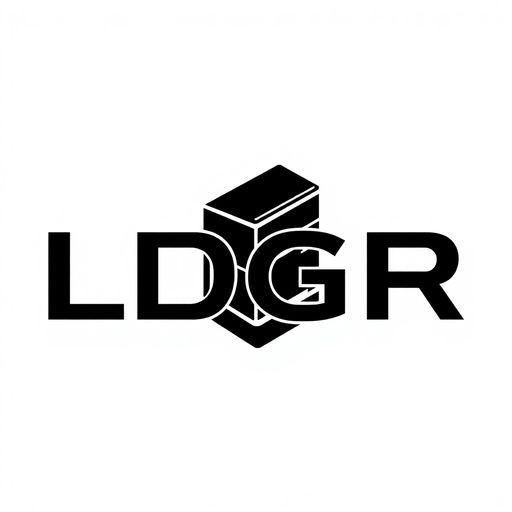

# LDGR
## Layered Data Gateway & Repository

<p align="center">
  
</p>

## Overview
LDGR is a blockchain-powered database management system that combines multi-layered security architecture with the flexibility of traditional databases. It provides military-grade encryption, immutable data storage, and controlled access through smart contract gateways.

## Features

- 🔐 **Blockchain Integration**
  - Ethereum blockchain for immutable data storage
  - Hardhat development environment
  - Smart contract-based data transactions
  - Decentralized data verification

- 🛡️ **High-Level Encryption**
  - AES-256 encryption for data at rest
  - RSA encryption for key exchange
  - End-to-end encryption for all transactions
  - Secure key management

- 📊 **Database Management**
  - User-friendly interface for database operations
  - Support for various data types and structures
  - Real-time data synchronization
  - Scalable architecture

- 🔒 **Security & Compliance**
  - Immutable audit trails
  - Access control and authorization
  - Data protection regulation compliance
  - Automated security scanning

## Prerequisites
- Node.js 18+
- Hardhat
- Ethereum wallet (MetaMask recommended)
- PostgreSQL or MongoDB

## Quick Start

1. Clone the repository:
```bash
git clone https://github.com/54MUR-AI/ldgr.git
cd ldgr
```

2. Install dependencies:
```bash
npm install
```

3. Set up environment variables:
```bash
cp .env.example .env
# Edit .env with your configuration
```

4. Compile smart contracts:
```bash
npx hardhat compile
```

5. Run local blockchain:
```bash
npx hardhat node
```

6. Deploy contracts:
```bash
npx hardhat run scripts/deploy.js --network localhost
```

## Development Status
🚧 **In Active Development** - LDGR is currently under development. Core features are being implemented and tested.

## Architecture
- **Frontend**: React.js with TypeScript
- **Backend**: Node.js with Express
- **Blockchain**: Ethereum with Hardhat
- **Database**: PostgreSQL/MongoDB
- **Encryption**: AES-256, RSA

## Contributing
We welcome contributions! Please see our contributing guidelines for more information.

## License
MIT License - see LICENSE file for details

## Contact
- GitHub: [@54MUR-AI](https://github.com/54MUR-AI)
- Project: [LDGR](https://github.com/54MUR-AI/ldgr)
